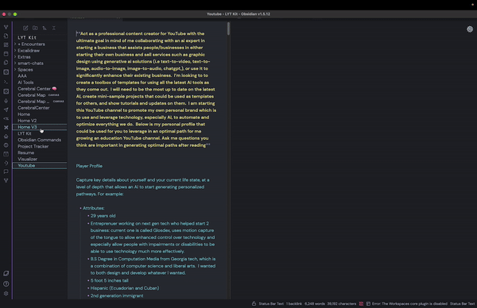
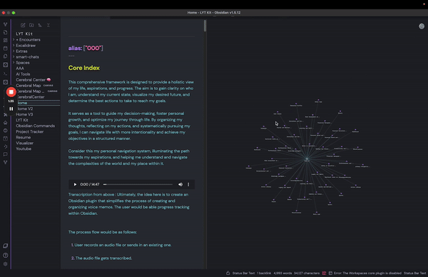

# Smart Connections Visualizer `v1.0`

Welcome to the Smart Connections Visualizer Plugin! This plugin integrates seamlessly with the Smart Connections tool, offering an advanced, interactive way to visualize connections between your notes. My goal is to enhance your ability to discover relationships and insights within your notes, transforming the way you interact with and understand your information.

## Features

- **Dynamic Force-Directed Graph:** Visualize connections as a force-directed graph where nodes represent notes or specific excerpts from them and edges represent connections.  
- **Easily view more relevant connections:** The distances between nodes and the central node (currently viewed note) are proportional to the relevance of the connections.  The closer the distance to the main node, the more relevant the connection is.  You can also adjust min and mx width of links to better distinguish these notes/blocks based on relevance.
- **Adjustable Visualization Settings:** Customize node size, label size, and text fade distance and more to tailor the visualization to your preferences.
- **Previewing Notes:** Ability to see note previews in the visualization view when hovering over a node.
- **Customizable Forces:** Adjust the repel force, link force, and center force for a more personalized layout.

## Installation

Getting started with the Smart Connections Visualizer Plugin is easy. Follow these steps to install and integrate it with your Smart Connections setup:

1. **Install Smart Connections Plugin:** Ensure you have the Smart Connections plugin installed in your Obsidian environment.
2. **Install Smart Connections Visualizer Plugin:** Download and install the Smart Connections Visualizer Plugin from the Obsidian Community Plugins.

## Usage

Once installed, the Smart Connections Visualizer Plugin provides an intuitive interface to explore your notes' connections.

### Opening the Visualizer

To open the Visualizer View:

1. Select the ribbon icon to the left that will display "Smart Connections Visualizer"
2. The visualization pane will appear, displaying a dynamic force-directed graph of your notes and their connections.

### Interacting with the Visualization

- **Zooming:** Use the mouse wheel or touchpad to zoom in and out of the view.
- **Panning:** Click and drag the visualization to move it around.
- **Hovering:** Hover over nodes to highlight them - displaying the full node label and link label, which right now the link label displays the relevance score.
- **Previewing Notes:** When hovering over a node, press the `Ctrl` (`Command` for Mac) key to view a preview of the note or block that the node represents.

### Customizing the Visualization

Access the settings menu by clicking the gear icon in the top right corner of the visualization pane. Here, you can adjust various parameters:

- **Minimum Relevance**: Adjust the slider to change the minimum relevance score needed for displaying connections.
- **Connection Type**: Choose whether to display connections by block, or by note.
- **Node Size**: Change the size of the nodes to make them more visible or to declutter the visualization.
- **Maximum Label Characters**: Define the maximum number of characters displayed on node labels before they truncate/are shortened. Note: hovering over a node will display the full node label.
- **Minimum Link Thickness**: Set the minimum thickness for the links. Helps to distinguish between less relevant connections.
- **Maximum Link Thickness**: Set the maximum thickness for the links. Helps to distinguish between less relevant connections.
- **Link Label Size**: Change the font size of the link labels. Note: Link label will display when hovering over a node.
- **Node Label Size**: Adjust the font size of the node labels.
- **Text Fade Threshold**: Set the zoom level at which labels fade in and out.
- **Repel Force**: Adjust the force that pushes nodes apart.
- **Link Force**: Modify the strength of the links between nodes.
- **Link Distance**: Adjust the distance between connected nodes - relevance distance will increase/decrease proportionally.

  
  

## Community and Support

Your involvement is crucial to the evolution of Smart Connections Visualizer. From troubleshooting issues to suggesting new features, every contribution enriches our community and drives the project forward! 

### Join The Community

- **GitHub Discussions**: Participate in discussions on GitHub to share your experiences and ask questions.
- **Contribute**: Help develop the plugin, report issues, or suggest new features.
- **User Testimonials**: Share how the plugin has impacted your workflow and creativity.

## Acknowledgements

Special thanks to Brian, the developer behind [Smart Connections](https://github.com/brianpetro/obsidian-smart-connections). 

## License

The Smart Connections Visualization Plugin is open-source and available under the MIT License. Contributions are welcome!

## About Me

Hi! Name's Evan Moscoso, and I'm a senior software developer/architect consultant for General Dynamics, contracted out to the CDC to manage and develop data visualization tools.  I've been obsessed about what's transpiring with AI for the last 15 years, knowing that it would soon change the world like this.  The text communication format between us and AI is **incredibly** inefficient, and I believe data visualization tools like this will not only exponentially enhance our ability to communicate with AI, but create a new discovery and decision making process that'll change how we go about virtually everything we do.  Our brains can't physically retain all the information AND use logic with it.  We need to offload the information into a visualization in order to save the state and keep progressing in complex problems.  

It's similar to playing a game of Sudoku, except there is no board and you have to do it all in your head. Just imagine the difference in your ability to solve the puzzle with and without the board. I can hear the music.. and I want nothing more to improve how we communicate and make better decisions.  

Inspired by Brian (creator of Smart Connections), I started an AI consulting company "Evan's Oasis" where I audit business workflows of clients and suggest AI tools and practices to significantly increase decision making, productivity, and quality– all while cutting down on time and money needed to run a business.  

I've continuosly been giving webinars to both CDC and GDIT on the most significant AI updates, as well as in-person local community seminars around the Tampa Bay area. 
One of my life's main questlines is to inspire people to take advantage of the outragous new abilities we have with AI and how we can use them to help us in our every day lives.

TLDR: I was born for this.

## The Future

I will begin adding future items here in a bit, but I can tell you there is ALOT to be done here that will change EVERYTHING.  The ultimate mission for this is to essentially do away with text-based organization and instead visualize information in a saved state that's dynamically arranged by whatever context the user desires (like a prompt).  A point where as you add on more notes, the state updates in a single visualization and you can see how the new information impacts the old through various relationships (i.e supportive vs contradictory statements related to the context), rather than have everything in separate folders even though technically everything is connected below a certain threshold.

I believe this would also eliminate the "hallucination" problem with AI where the saved state is the visualization and independent on whatever it is the AI remembers.  It will always have the right context! 

The point is to see everything you couldnt see before and watch what happens when you update information as it cascades and affects all other connections.  We're about to enter a realm of exponenitally increased problem solving through visualizing our text-based information and the possibilites are endless!  I'm spending a lot of time on this on top of my other jobs, so any support would be more than appreciated to give me more time to keep going at it :) 

---

Feel free to reach out with any questions or suggestions. I hope this plugin enhances your note-taking experience and helps you uncover new insights and connections within your notes. Happy visualizing!
